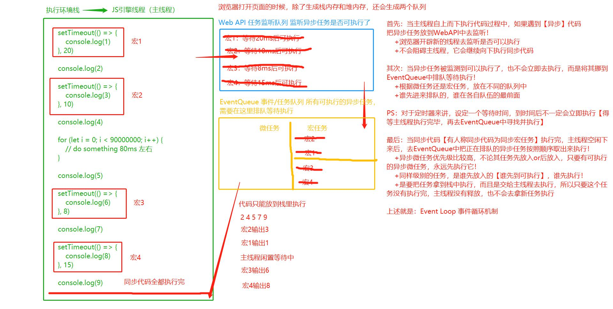

# event-loop-exercise
Event Loop 事件循环机制代码实践

## 进程与线程

- 进程：一个程序相当于一个进程【浏览器打开一个页卡】
- 线程：程序中具体做事的人

## 同步与异步

- 同步：如果做事的只有一个人，当前事未结束，下件事做不了【同步】
- 异步：如果做事的有多个人，当前事未结束，下件事其他人可以去做【异步】

> 单线程只能同步，多线程可以异步

## 浏览器是多线程的

- GUI 渲染线程：渲染和解析页面（自上向下）
- JS 引擎线程：渲染和解析 JS 【浏览器只会分配一个线程去解析 JS，所以 JS 本身是单线程的】
- 定时器监听线程
- 事件监听线程
- HTTP 网络请求线程【同源下，浏览器最多分配 5~7 个 HTTP 线程（并发上限）】
- Web Worker 线程
- 等等

> JS 是单线程运行的，所以其中大部分代码都是同步执行的（例如：循环）
> 
> 所以在 JS 中千万不要写死循环、死递归等操作，这些操作会一直占用 JS 引擎线程，导致后续的代码都无法执行
> 
> 但是 JS 中也有部分异步执行的代码：异步微任务、异步宏任务
> 
> JS 中的异步执行：借用浏览器的多线程机制，再基于 Event Loop 事件循环机制实现的单线程异步效果

## 异步微任务【microtask】

- requestAnimationFrame
- Promise
- async/await
- queueMicrotask
- MutationObserver
- IntersectionObserver
- process.nextTick【Node】

## 异步宏任务【macrotask】

- setTimeout/setInterval
- 事件绑定/队列
- XMLHttpRequest/Fetch
- MessageChannel
- setImmediate【Node】

## exercise/2

